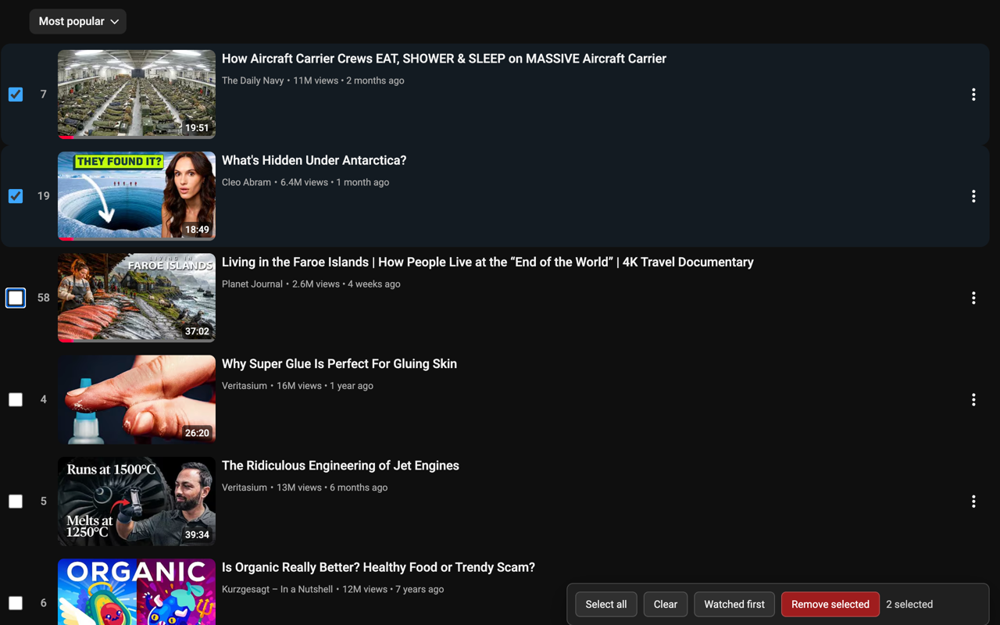

# Watch Later Manager for YouTube

<p align="center">
  
</p>

Clean up YouTube Watch Later faster with checkboxes, batch remove, and watched-first sorting.

This is a small Chrome Manifest V3 extension for people whose Watch Later list is easy to fill but hard to clean. It adds simple controls directly to the visible Watch Later page, without using YouTube APIs or storing account data.

**[Install from Chrome Web Store →](https://chromewebstore.google.com/detail/watch-later-manager-for-y/jleceiefdnhnjifpebbnlgjbmhijnmpn)**

## Preview



## Features

- Select visible Watch Later videos with checkboxes.
- Select all visible rows.
- Clear the current selection.
- Remove selected videos in one run.
- Sort loaded videos so watched or higher-progress videos move to the top.
- Keep YouTube's normal page, menus, and infinite scrolling.

## How It Works

Open `https://www.youtube.com/playlist?list=WL`. The extension adds a small toolbar at the bottom of the page with these controls:

- `Select all`
- `Clear`
- `Watched first`
- `Remove`

`Remove` uses YouTube's visible row menu and clicks `Remove from Watch later` for each selected row.

`Watched first` reads the progress shown on the page and visually sorts only videos that are already loaded. It does not permanently reorder your playlist.

## Privacy

The extension runs locally in the browser.

It does not:

- use the YouTube API
- make private YouTube network requests
- read or store account credentials
- read or store cookies or tokens
- use analytics, ads, or external servers
- run remote code

## Limits

- It only works on the YouTube Watch Later playlist page.
- It only manages videos already loaded into the page.
- It does not permanently reorder the playlist.
- It does not batch Save to playlist in this version.
- It may need updates if YouTube changes its page layout or menu wording.

## Local Testing

1. Open `chrome://extensions`.
2. Turn on Developer mode.
3. Click Load unpacked.
4. Choose this project folder.
5. Open `https://www.youtube.com/playlist?list=WL`.
6. Test Select all, Clear, Watched first, Remove, and infinite scroll.

## Development Checks

Run the local helper tests:

```sh
node tests/run-tests.js
```

Validate the manifest:

```sh
node -e "JSON.parse(require('node:fs').readFileSync('manifest.json','utf8')); console.log('manifest ok')"
```

## Package for Chrome Web Store

Run:

```sh
sh scripts/package-extension.sh
```

Upload:

```text
dist/youtube-watchlist-manager.zip
```

The upload ZIP contains only runtime files: `manifest.json`, `src/`, and `icons/`.

## Store Assets

- Screenshot: `assets/store/screenshot-watch-later-toolbar.png`
- Small promotional image: `assets/store/promo-small.png`

## GitHub Pages Site

The static landing page and privacy policy live in `site/`.

GitHub Pages deploys through `.github/workflows/pages.yml`. Set the repository Pages source to GitHub Actions.

Public site:

- Landing page: `https://liewcf.github.io/youtube-watchlist-manager/`
- Privacy policy: `https://liewcf.github.io/youtube-watchlist-manager/privacy.html`

The extension is published on the Chrome Web Store: [Watch Later Manager for YouTube](https://chromewebstore.google.com/detail/watch-later-manager-for-y/jleceiefdnhnjifpebbnlgjbmhijnmpn). The `chromeWebStoreUrl` in `site/script.js` is set to the live listing URL.

## Trademark

YouTube is a trademark of Google LLC. This extension is not made by, endorsed by, or sponsored by Google or YouTube.
